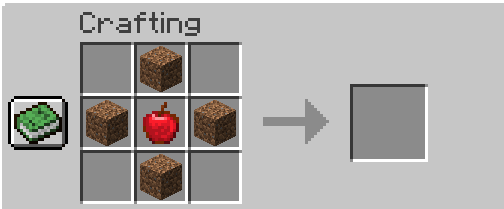

## Introduction

Dans cet artcile nous allons voir comment générer nos différents crafts à l'aide
d'un générateur.

## Code

### Création du générateur

Créez une nouvelle classe avec comme nom par exemple ``RecipeGenerator`` qui hérite de
la classe ``RecipeProvider``.

````java
public class RecipeGenerator extends RecipeProvider {

    public RecipeGenerator(DataGenerator gen) {
        super(gen);
    }

    @Override
    protected void buildCraftingRecipes(Consumer<FinishedRecipe> p_176532_) {

    }
}
````

Ecrivez le constructeur imposé par la classe mère, puis re définissez la méthode
`buildCraftingRecipes` en supprimant le `super`.

Rendez vous maintenant dans votre classe avec l'event ``GatherDataEvent`` et
ajoutez le générateur comme ceci :

````java
@SubscribeEvent
    public static void dataGen(final GatherDataEvent e)
    {
        DataGenerator generator = e.getGenerator();

        if(e.includeClient())
        {

        }

        if(e.includeServer())
        {
            generator.addProvider(new RecipeGenerator(generator));
        }
    }
````

:::tip
Les crafts sont gérés par le serveur, on exécute donc la génération des recettes
seulement si l'event l'inclus.
:::

De cette façon on ajoute notre générateur de crafts aux générateurs associés à notre
mod.

## Recettes dans la table de craft

:::tip
Il faut savoir que dans Minecraft, il y a plusieurs types de crafts. Les *shaped* et
*shapeless*.

Les *shaped* définissent les crafts dont la disposition des items dans
la table doit respecter un certain schéma.

``Ex: les épées, les pioches, la table d'enchantement, les coffres, etc...`` 

Les *shapeless* eux n'ont pas de forme prédéfinie.
Seul le contenu même du craft importe.

``Ex: les feux d'artifices (customisation), les soupes de champignons, etc...``
:::

### Shaped recipes

Pour l'exemple, je vais créer un craft qui me donnera 1 diamant lorsque je disposerai
une croix de dirt avec une pomme au milieu.



Allez dans la fonction `buildCraftingRecipes` puis insérez ce code :

````java
ShapedRecipeBuilder.shaped(Items.DIAMOND, 1)
                .define('D', Blocks.DIRT)
                .define('A', Items.APPLE)
                .pattern(" D ")
                .pattern("DAD")
                .pattern(" D ")
                .group("diamond")
                .unlockedBy("unlock", InventoryChangeTrigger.TriggerInstance.hasItems(ItemPredicate.Builder.item().of(Items.APPLE).of(Blocks.DIRT).build()))
                .save(consumer, new ResourceLocation(Testmod.MODID, "mon_craft"));
````

Ne vous inquiètez pas, au premier abord, ça paraît un peu compliqué, mais en décomposant
petit à petit ça va se clarifier. On voit donc qu'on a besoin de la classe ``ShapedRecipeBuilder``
qui comme son nom l'indique permet de construire notre craft. A l'aide de plusieurs fonctions
on va pouvoir définir les propriétés de notre craft.

````java
shaped(Items.DIAMOND, 1)
````

La fonction ``shaped`` sert à donner le résulat, du craft. Oui, on commence par le résultat
et non par les ingrédients. En premier argument vous pouvez donner un ``Item``, ``Block`` ou
même un ``Tag<Item>``.

:::tip
Ce dernier est très utile pour des crafts utilisant les laines
de couleurs par exemple, vous permettant de spécifier l'ensemble des laines.
:::

En deuxième argument, vous pouvez, si vous le souhaitez, donner la quantité de votre
résultat. Dans cet exemple je vais laisser la quantité à **1**.

````java
define('D', Blocks.DIRT)
define('A', Items.APPLE)
````

La fonction define permet d'associer à un caractère un item, un block, ou encore un tag.
De cette manière, lorsqu'on dessinera le schéma de notre craft, le caractère ``D`` sera
associé au bloc de terre dans ce cas là.

:::tip
Ici le caractère 'D' n'est pas anodin. Etant donné que j'utliser le bloc de ``Dirt``,
j'ai pris l'initial du mot comme caractère. Essayer de rendre vos craft le plus lisible
possible. Comme votre code d'ailleurs !
:::

````java
pattern(" D ")
pattern("DAD")
pattern(" D ")
````

La fonction ``pattern`` sert à donner la forme de notre craft. Souvenez-vous de la forme
que j'ai donné plus haut. Chaque ``pattern`` représente une ligne de la table de craft.
Ici on utlise tout l'espace disponible de notre table, donc nous sommes obligés de combler
les vides avec des espaces. Un espace représentant un item vide, soit rien.
La table de craft de Minecraft ayant 3x3 slots, il y a trois lignes composées chacune
de 3 caractères au maximum.

:::caution
Verifiez bien que vous ne dépassez pas la limite de caractère ou de lignes. C'est souvent
la cause d'erreurs ou bien de dysfonctionnement de votre craft.
:::

Vous n'êtes pas obligés d'utiliser les trois lignes de la table ou même de remplir chaque
ligne. Par exemple, pour crafter une épée on ferait ça :

````java
pattern("D")
pattern("D")
pattern("A")
````

En faisant cela, on a bien la forme de l'épée et on peut crafter l'épée sur n'importe
quelle colonne de la table. Egalement le craft de la table de craft ressemble à cela :

````java
pattern("DD")
pattern("DD")
````

On a juste besoin de deux lignes et les quatre éléments en forme de carré.
De cette manière on peut crafter notre table dans n'importe quel coin de la table
ou même dans l'inventaire du joueur.

````java
group("diamond")
````

La fonction ``group`` sert quant à elle de rassembler différents crafts pour le même
objet. Ici, j'ai décidé de créer un groupe ``diamond`` étant donné que mon craft
donne un diamant. C'est à dire que tous les crafts ayant le même group seront rassemblés
dans le livre de recettes du jeu.

````java
unlockedBy("unlock", InventoryChangeTrigger.TriggerInstance.hasItems(ItemPredicate.Builder.item().of(Items.APPLE).of(Blocks.DIRT).build()))
````

La fonction ``unlockedBy`` sert à définir le moyen d'obtention du craft. Comme vous le
savez, les crafts sont obtenus soit en ayant un item dans l'inventaire soit par le
biais d'autres recettes. C'est ce qu'on appelle un ``Criterion`` et il y en a plusieurs.
Ici pour l'exemple j'utliserai le plus simple : ``InventoryChangeTrigger``. C'est
un criterion qui se déclenche lorsque le joueur possède dans son inventaire certains
items. Ici la fonction ``hasItems`` prend en compte soit un item directement, soit
un ``ItemPredicate`` et c'est ce qu'on utlise ici.

Je ne vais pas détailler ici ce qu'est
un *Predicate*, ici ce sera juste un ensemble d'items qui permettront de débloquer le craft.
Dans mon cas, les items en question seront : la pomme et le bloc de terre.

````java
save(consumer, new ResourceLocation(Testmod.MODID, "mon_craft"))
````

Enfin, la fonction save sert, comme son nom l'indique, à sauvegarder notre craft. En
premier paramètre on renseigne ``consumer`` qui est le paramètre de notre fonction
``buildCraftingRecipes``. En second paramètre on doit renseigner une `ResourceLocation`
qui est en fait l'emplacement et le nom du fichier ``.json``.

Comme emplacement, j'ai mis le modid de mon mod, c'est à dire que le fichier sera
stocké dans les crafts de mon mod. Vous auriez pu laisser ``minecraft`` mais je le déconseille.
Enfin, ``"mon_craft"`` désigne le nom du fichier final.

:::caution
Faites attention de ne pas avoir deux crafts différents ayant le même nom !
:::

Et voilà, il ne vous reste plus qu'à lancer ``runData`` et vous devriez avoir vos fichiers
de générés dans le dossier ``generated`` de votre workspace.

:::tip
A partir de la version 36.2.0 de Forge, il possible de laisser les fichiers dans le
dossier ``generated``. Ils seront tout de même détectés par le jeu. Vous n'avez donc
plus besoin de les déplacer dans le dossier ``resources`` manuellement.
:::

### Shapeless recipes

### Autres

## Recettes de cuisson

## Recettes dans le stonecutter

## Recettes dans la smithing table


